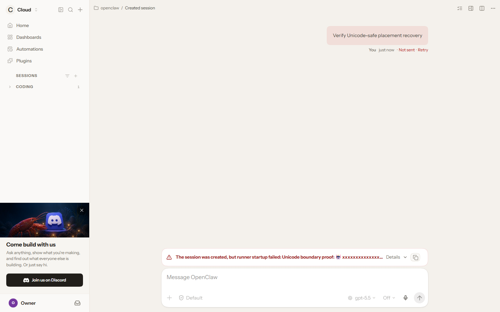
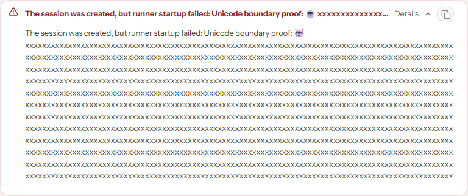

# PR #137649 built Control UI proof

This proof was captured from exact PR head
`b742a71afd25f88062554e93dc5d6a5fb26cd12a` on Windows with Node
`v24.13.1`, pnpm `12.1.0`, `pako@3.0.1`, Playwright `1.62.1`, and the
repository's bundled Control UI E2E harness.

The test built the production Control UI, opened it in Chromium, selected the
mocked `Cloud - aws` placement, created a session, and rejected
`sessions.dispatch` with a diagnostic whose final astral character crossed the
4,096 UTF-16-unit storage boundary. The resulting paused, retryable placement
error was then checked in the rendered DOM and captured in both collapsed and
expanded states.

Observed result:

```json
{
  "diagnosticUtf16Length": 4095,
  "renderedUtf16Length": 4147,
  "renderedWellFormed": true,
  "renderedEndsWithSurrogate": false,
  "route": "/chat/cloud/unicode-placement-proof"
}
```

Focused result: one test file passed, one test passed. The production UI build
completed successfully before the Chromium flow ran.

## Captures




